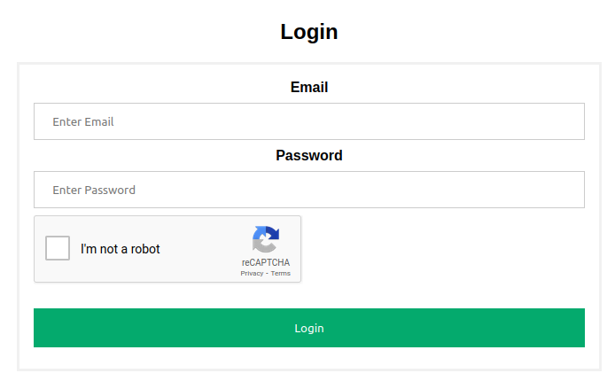
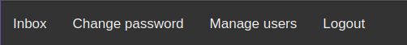
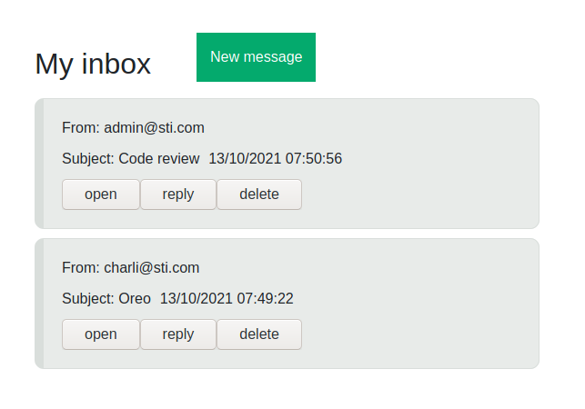
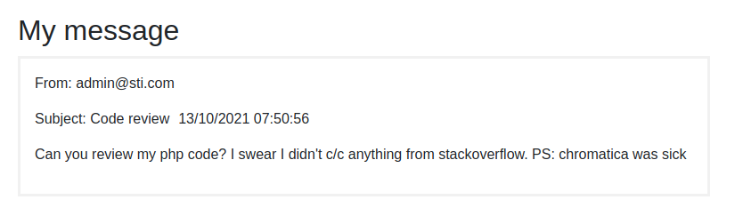
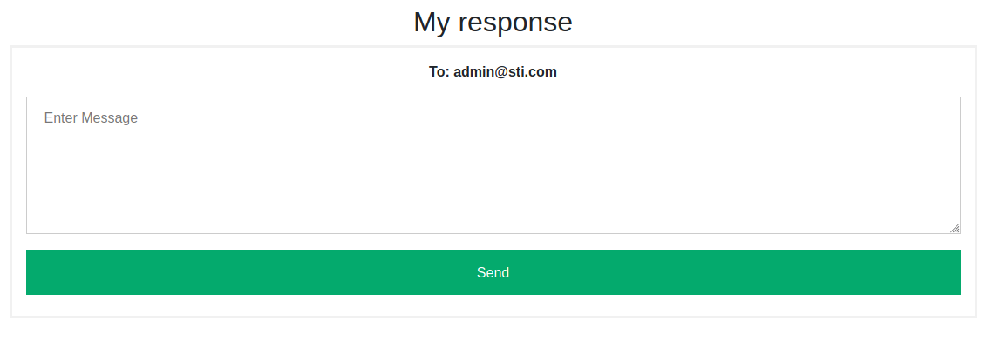
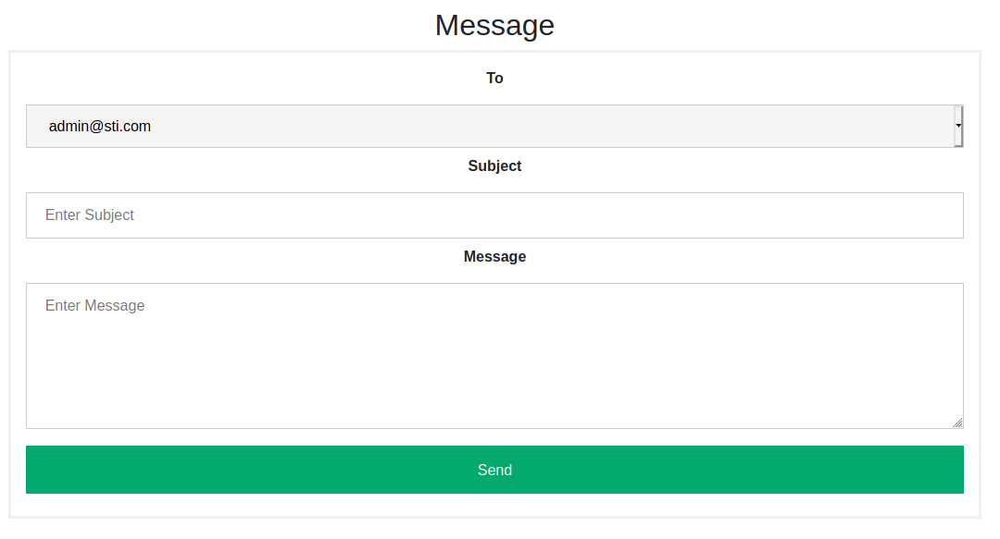
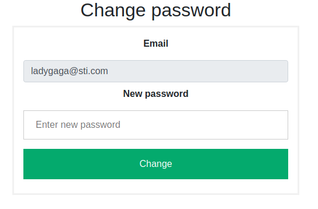
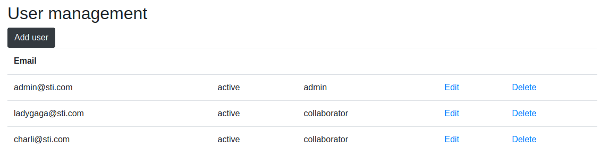
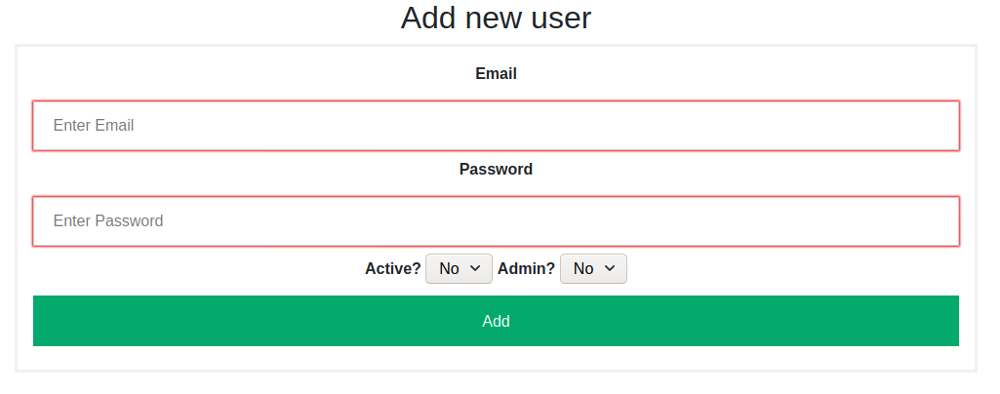
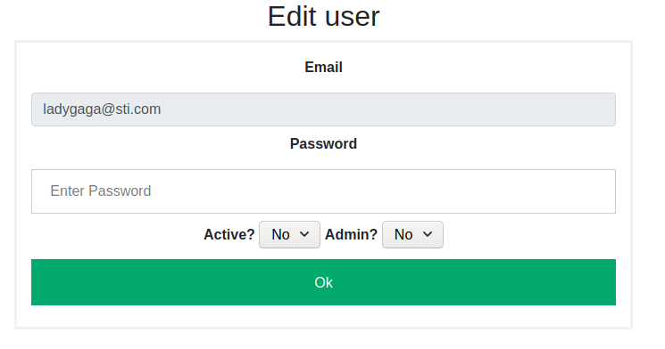

# STI - Projet 2

Auteurs: Besseau Léonard et Cerottini Alexandra

Date: 17.01.2022

Repo projet 1: https://github.com/Insuline13/STI-Projet1


## Introduction

Ce projet est une application Web très simple et sécurisée permettant d'envoyer des messages entre des collaborateurs.

Les technologies utilisées sont Docker, PHP et SQLite.


## Installation

Cloner l'archive Github avec la commande `git clone git@github.com:Insuline13/STI-Projet1.git`. 


## Lancement

Une image Docker contenant un serveur Nginx, PHP et SQLite est utilisée. Si l'image Docker n'existe pas, il faut au préalable lancer la commande suivante à la racine du repository:

```shell
docker run -ti -v "$PWD/site":/usr/share/nginx/ -d -p 8080:80 --name sti_project --hostname sti arubinst/sti:project2018
```

Il faut ensuite lancer le script `script_strating.sh` dans le dossier `site`. 

```sh
./script_starting.sh
```

Il suffit ensuite d'aller dans le navigateur sur `localhost:8080` pour accéder à l'application web.


## Utilisation

### Login

Lorsqu'un utilisateur n'est pas connecté, il se retrouvera face à une page de login.

Pour se connecter, il suffit d'entrer un email, un mot de passe, de valider le reCAPTCHA et de cliquer sur `Login`. Si les informations entrées ne sont pas valides ou que le reCAPTCHA est incorrect, l'utilisateur se retrouvera à nouveau sur la page de login. Sinon, il se retrouvera dans sa boîte mail.

L'un des comptes suivant peut-être utilisé:

| email            | mot de passe     | statut        |
| ---------------- | ---------------- | ------------- |
| admin@sti.com    | _LmyZ+A4J%ZX,T`t | admin         |
| ladygaga@sti.com | Pokerf@ce911     | collaborateur |



### Barre de navigation

Cette barre permet de naviguer entre les différentes fonctionnalités proposées par l'application web. Un collaborateur pourra naviguer vers la boîte mail, changer son mot de passe ou se logout en cliquant dessus. Un admin pourra également gérer les différents utilisateurs.



### Boîte de réception

Après s'être connecté, l'utilisateur est redirigé vers sa boîte de réception.



Pour chaque message, l'utilisateur peut: 

- l'**ouvrir** pour avoir accès au corps du message:



Pour revenir à la boîte de réception, il suffit d'utiliser la barre de navigation.

- y **répondre**:



- le **supprimer**

L'utilisateur peut également envoyer un nouveau message en cliquant sur le bouton `New message` :



### Changer de mot de passe

Cette page permet à l'utilisateur actuel de changer son mot de passe. Il lui suffit d'entrer un nouveau mot de passe respectant la politique de mot de passe (entre 8 et 20 caractères contenant au minimum 1 minuscule, 1 majuscule, 1 chiffre et 1 caractère spécial) et de cliquer sur `Change` pour que celui-ci soit changé. Lorsque le changement a été effectué, l'utilisateur est dirigé sur sa boîte mail.



### Gestion utilisateurs (admin)

Cette page permet à un administrateur de gérer les comptes des utilisateurs de l'application web.



#### Ajouter

En cliquant sur `Add user` une nouvelle page s'ouvre et un nouvel utilisateur peut-être ajouté. Il suffit pour cela de remplir tous les champs et de cliquer sur `Add`.  Lorsque l'opération a été réalisée, l'utilisateur est redirigé sur la page de gestion des utilisateurs.



#### Modifier

En cliquant sur `Edit`, une nouvelle page s'ouvre et le mot de passe, la validité et/ou le rôle de l'utilisateur peuvent être modifiés. Il suffit de modifier les champs souhaités puis de cliquer sur `Ok`. Lorsque l'opération a été réalisée, l'utilisateur est redirigé sur la page de gestion des utilisateurs.



#### Supprimer

En cliquant sur `Delete`, l'utilisateur sélectionné sera définitivement supprimé de la base de données. Lorsque l'opération a été réalisée, l'utilisateur est redirigé sur la page de gestion des utilisateurs.

### Logout

En cliquant sur `Logout` dans la barre de navigation, l'utilisateur sera déconnecté et redirigé sur la page de login.

