# Rapport étude de menaces

Auteurs: Besseau Léonard et Cerottini Alexandra

Date: 17.01.2022


## Introduction

Ce projet est une application Web permettant d'envoyer des messages électroniques entre des utilisateurs au sein d'une entreprise. Il permet en plus à des administrateurs de gérer les différents utilisateurs (ajout, modification ou suppression d'un utilisateur).

Les technologies utilisées sont Docker, PHP et SQLite.

L'objectif du projet est d'identifier les failles de sécurité au niveau applicatif, d'analyser les menaces et de sécuriser l'application développée par un des membres du groupe du projet 1. Le cahier des charges du projet 1 doit être respecté.

Nous allons seulement nous intéresser aux vulnérabilités introduites par le code PHP. La sécurisation du serveur web et de la machine sera ignorée. Des recommandations pourront être émises mais ne seront pas corrigées.


## Le système

### Objectifs

Le système a pour objectif de permettre à des employés au sein d'une entreprise de s'envoyer des messages électroniques. Le contenu de l'application est donc dynamique et généré par les utilisateurs. L'application est importante pour la communication interne de l'entreprise.


### Hypothèses de sécurité

- Une personne externe ne peut pas avoir un compte
- Seulement les employés actifs de l'entreprise peuvent utiliser l'application web
- Les administrateurs de la base de données et de l'application sont de confiance
- Il est impossible d'usurper l'identité du serveur


### Exigences de sécurité

- Il faut être authentifié pour utiliser l'application web

- Le compte de l'utilisateur doit être actif pour pouvoir se connecter 

- Seuls les administrateurs peuvent ajouter, supprimer ou modifier un utilisateur

- Seuls les administrateurs peuvent voir les informations personnelles (mail, validité, rôle) des autres utilisateurs mais ils ne peuvent pas voir leur mot de passe

- Personne ne peut lire et supprimer les messages électroniques qui sont destinés à d'autres personnes

- Personne ne peut supprimer ou modifier un message après l'avoir envoyé

- Personne ne peut envoyer un message électronique au nom d'une autre personne

  

### Constitution

#### Élements du système

- Base de données des utilisateurs

- Base de données des messages électroniques

- Application Web (Server applicatif PHP + server web NGINX)

  

#### Rôles des utilisateurs

- Collaborateur

Les collaborateurs peuvent lire les messages électroniques qu'ils ont reçu, écrire un nouveau message à l'attention d'un autre utilisateur ou d'eux-même, répondre à un message, supprimer un message et changer leur propre mot de passe.

- Administrateur

Les administrateurs ont accès aux mêmes fonctionnalités que les collaborateurs mais ils peuvent en plus ajouter, modifier ou supprimer un utilisateur.


### DFD

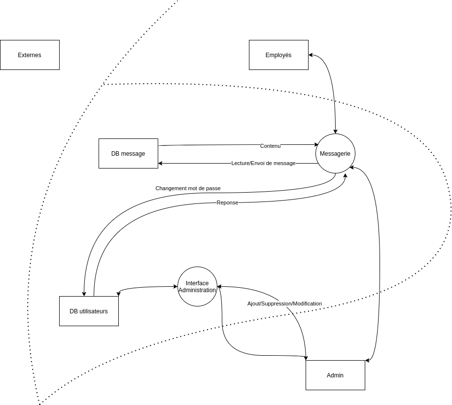


### Les biens

- Application Web

  - Disponibilité

  L'application se doit d'être disponible pour être utilisable. Son interruption pourrait perturber le fonctionnement de l'entreprise.

  - Authenticité + Confidentialité

  Seuls les membres de l’entreprise ont accès à l'application. Si ce n'est pas le cas, une personne externe à l'entreprise pourrait obtenir des informations confidentielles.

- La base de données
  - Table users (liste des utilisateurs)

    - Confidentialité

    Les données personnelles ne doivent pas être accessibles aux autres utilisateurs (sphère privée).

    - Intégrité

    Une modification des données pourrait nuire à un utilisateur.

  - Table messages (liste des messages)

    - Confidentialité

    Les messages entre 2 utilisateurs sont censés être confidentiels pour tous les autres utilisateurs.

    - Intégrité

    Un message ne doit pas être modifié après envoi ou supprimé par l'auteur (non-répudiation).

    - Authenticité

    L'auteur d'un message doit être le véritable auteur (réputation).

L'application web doit seulement être accessible aux collaborateurs et aux administrateurs (sauf la page de login). Les actions des administrateurs sur les utilisateurs sont confidentielles et seulement les administrateurs peuvent les réaliser.

La base de données contient des données sensibles sur les utilisateurs comme leur mot de passe ainsi que les messages qu'ils ont échangé. Il faut de la confidentialité.

Si un incident se produit, celui-ci nuirait la réputation de l'application Web et entraînerait un problème de communication au sein de l'entreprise. De plus, il y aurait une perte de confiance de la part des employés.


### Périmètre de sécurisation

- Personne sauf les administrateurs ne doit pouvoir accéder à la page de gestion des utilisateurs
- Personne ne doit avoir accès aux messages des autres utilisateurs
- Personne ne doit pouvoir envoyer un message en se faisant passer pour quelqu'un d'autre
- Personne ne doit pouvoir modifier ou supprimer un message après l'avoir envoyé
- Personne ne doit pouvoir récupérer le mail et le mot de passe d'un utilisateur


## Identifier les sources de menaces

- Employés mécontents
  - Motivation: vengeance, curiosité, espionnage industriel
  - Cible: lire des messages d'autres utilisateurs, élévation de privilège, déni de service
  - Potentialité: haute
- Cybercriminels
  - Motivation: financières
  - Cible: vol de credentials des utilisateurs, modification d'informations, phishing
  - Potentialité: moyenne
- Concurrents
  - Motivation: espionnage industriel
  - Cible: lire les messages des utilisateurs, déni de service, sabotage
  - Potentialité: moyenne
- Hackers, script-kiddies
  - Motivation: s'amuser, gloire
  - Cible: n'importe quel élément /actif
  - Potentialité: faible


## Les scénarios d'attaques

#### Scénario 1: Indisponibilité du service

Stride: denial of service

Impact: élevé (financier)

Source de la menace: hacker, concurrent, employé mécontent

Motivation: défi, rançon (crime organisés), gêner l'activité 

Cible: serveur web

Scénario d'attaque: 

- XSS
  - Une injection XSS peut être faite dans le sujet ou le corps du message pour rediriger sur une autre page, empêchant ainsi d'utiliser l'application. Selon sur quelle page l'utilisateur est redirigé, une boucle infinie peut être créée. Il suffit à l'attaquant d'envoyer un message à un autre utilisateur (non admin) en mettant dans le sujet du message par exemple: `<script>window.location.href="http://www.localhost:8080/view/users.php";</script>`. Cela redirigera l'utilisateur allant sur sa boîte mail directement sur la page gérant les utilisateurs mais celle-ci n'est pas accessible à un simple utilisateur donc il sera redirigé sur sa boîte mail, ceci en boucle.

Contrôles: Validation des entrées

#### Scénario 2: Récupération des données internes

Stride: information disclosure

Impact: élevé (financier, réputation, données personnelles)

Source de la menace: concurrent, hacker, cybercriminel, employé mécontent

Motivation: récupérer des informations

Cible: base de données

Scénario d'attaque: 

- Injection SQL

  - Avec une injection SQL, on peut afficher le premier mail de la base de données. En effectuant une requête pour lire un message, l'attaquant connecté sur l'application web peut modifier la value du mail de son choix en y ajoutant une requête SQL par exemple:

    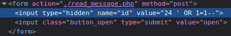

    Le résultat sera le premier mail de la base de donnée alors qu'il est possible que celui-ci ne lui était pas destiné. Il faut noter également que les id des messages sont séquentiels.

- Accès arbitraire aux données

  - Il est possible d'accéder à n'importe quel message sans restriction d'accès, même si le message ne nous est pas destiné. Les id des messages étant séquentiels, on peut tous les obtenir rapidement.

    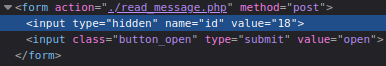


Contrôles: 

- Validation des entrées
- Contrôle des accès

#### Scénario 3: Suppression des données

Stride: tampering, repudiation

Impact: élevé (financier, données personnelles)

Source de la menace: employé mécontent, concurrent

Motivation: supprimer des informations

Cible: base de données

Scénario d'attaque: 

- Injection SQL

  - Avec une injection SQL, on peut supprimer tous les mails de la base de données. Pour ce faire, l'attaquant connecté sur l'application web peut modifier la requête de suppression d'un mail de son choix en y ajoutant une requête SQL par exemple:

    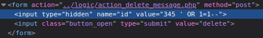

    Lorsqu'il effectuera la requête, tous les mails seront supprimés.

- Autorisation bypass

  - Un attaquant pourrait utiliser les techniques décrites dans **Vol de session/Compte** pour obtenir une autre session et ensuite supprimer les messages.

- Envoi d'une requête non-authentifié

  - N'importe qui (même une personne non-connectée) sur l'application web peut supprimer n'importe quel message de la base de donnée en effectuant la requête directement.

    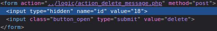

Contrôles: 

- Validation des entrées
- Contrôle des accès
- Vérifier que l'action est effectuée sur un message appartenant à l'utilisateur

#### Scénario 4: Modification des données

Stride: repudiation, tampering, elevation of privileges

Impact: élevé (financier, données personnelles)

Source de la menace: employé mécontent, hacker, concurrent

Motivation: modifier des informations, défi, sabotage

Cible: base de données

Scénario d'attaque: 

- Injection SQL

  - Avec une injection SQL, il est possible de modifier les mots de passe de toute la base de données. Il suffit d'effectuer la requête pour modifier un mot de passe avec une injection dans le nom d'utilisateur pour changer les mots de passe. Par exemple:

    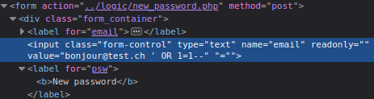

    Nous pouvons voir sur *phpliteadmin* que tous les utilisateurs ont les mêmes mots de passe

    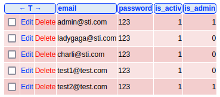

    L'attaquant peut donc accéder à tous les comptes.

- CSRF

  - L'attaquant peut construire une attaque CSRF modifiant automatiquement le mot de passe d'un utilisateur par un mot de passe voulu et par exemple envoyer un faux site web à l'utilisateur par mail. Lorsque l'utilisateur cliquera sur ce site web malicieux, une requête vers le site vulnérable sera effectuée et son mot de passe aura été modifié sans qu'il s'en aperçoive. L'attaquant pourra ensuite se connecter sur le compte de l'admin et accéder aux données de celui-ci.

    Il faudrait faire une requête POST avec l'email de la cible et le mot de passe voulu vers `logic/new_password.php`. Ceci peut être effectué sur le site malicieux en créant un formulaire invisible et en le soumettant automatiquement dès que la page est chargée.

- Autorisation bypass

  - Un attaquant pourrait utiliser les techniques décrites dans **Vol de session/Compte** pour obtenir une autre session et ensuite supprimer les messages.

- Modification du mot de passe d'un autre utilisateur

  - Un attaquant peut modifier le mot de passe d'un utilisateur arbitraire. Pour ce faire, il lui suffit de modifier l'email et de choisir le mot de passe qu'il veut. Par exemple:

    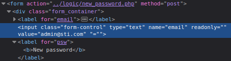


Contrôles: 

- Validation des entrées
- Contrôle des accès
- Token anti-CSRF

#### Scénario 5: Deviner un mot de passe

Stride: spoofing

Impact: moyen (données personnelles, réputation)

Source de la menace: employé mécontent, hacker, cybercriminel, concurrent

Motivation: usurpation d'identité, lire messages de quelqu'un d'autre, avoir accès aux fonctionnalités des administrateurs, défi, accès à l'application

Cible: credentials

Scénario d'attaque: 

- Tests de mots de passe simple (ex: 123) car aucune vérification
  - L'attaquant peut tester une liste de mot de passe récurrents à l'aide d'un outil car lors de la création d'un compte ou lors du changement du mot de passe, il n'est pas demandé que celui-ci comporte un nombre minimum de caractères, de chiffres ou de caractères spéciaux.

- Pas de limite d'essai de mot de passe
  - L'attaquant peut tester n'importe quel mot de passe à volonté à l'aide d'un outil.


Contrôles: 

- Mettre en place un mot de passe fort (au moins 8 caractères avec au moins 1 chiffre, 1 majuscule, 1 minuscule et 1 caractère spécial)
- Limiter le nombre de tentatives de login

#### Scénario 6: Vol de mot de passe

Stride: spoofing, information disclosure 

Impact: élevé (données personnelles, réputation)

Source de la menace: employé mécontent 

Motivation: usurpation d'identité, lire messages de quelqu'un d'autre, avoir accès aux fonctionnalités des administrateurs

Cible: credentials

Scénario d'attaque: 

- Un employé peut utiliser Wireshark sur le réseau interne de l'entreprise

  - Les informations transitent en clair sur le réseau donc lorsqu'un utilisateur se connecte à son compte, une autre personne se trouvant sur le même réseau peut sniffer le trafic et récupérer les credentials de cet utilisateur.

    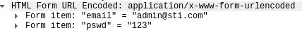


Contrôles: 

- Utiliser HTTPS pour sécuriser les connexions

#### Scénario 7: Vol de session/Compte

Stride: spoofing, tampering, repudiation, information disclosure, elevation of privileges

Impact: élevé (données personnelles, réputation)

Source de la menace: employé mécontent, hacker, cybercriminel, concurrent

Motivation: usurpation d'identité, lire messages de quelqu'un d'autre, avoir accès aux fonctionnalités des administrateurs, défi, accès à l'application

Cible: cookie de session, login

Scénario d'attaque: 

- Injection SQL
  - Un attaquant peut injecter `' OR 1=1--` à la place du mot de passe lorsqu'il essaye de se login et peut se connecter sans avoir le mot de passe.

- Voler un cookie de session PHP par défaut (PHPSESSID) avec une attaque XSS

  - Grâce à [Requestbin](https://requestbin.net/) (un site nous permettant de récupérer des requêtes), un attaquant peut voler le cookie de session de l'admin. Pour ce faire, il lui suffit d'envoyer un mail contenant une attaque XSS à l'admin (l'attaque peut être réalisé dans le subject ou dans le message).

    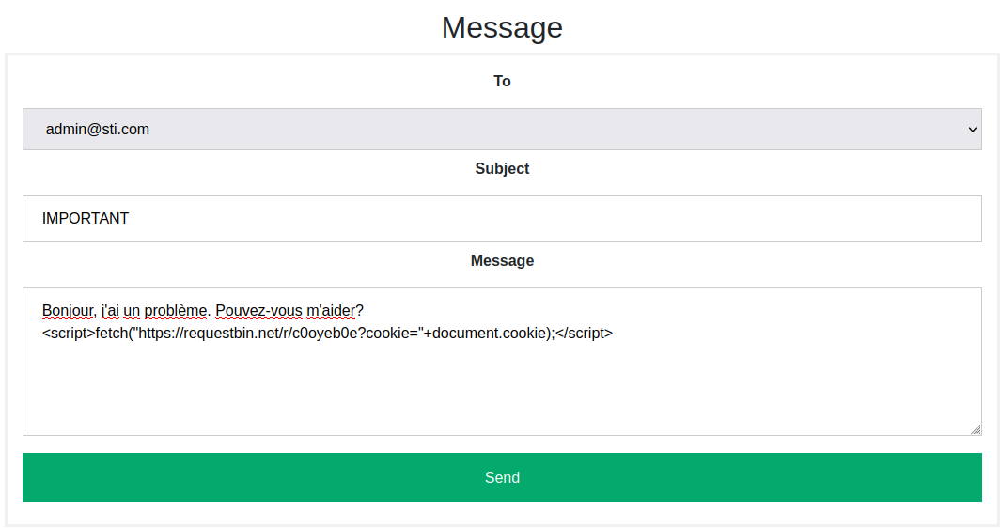

    Lorsque l'admin ouvrira le message il ne verra rien d'anormal mais l'attaque XSS aura été réalisée.

    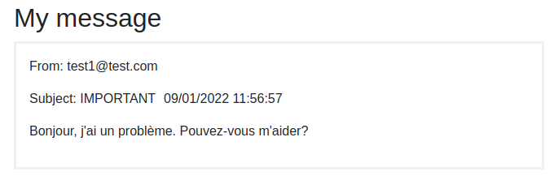

    Sur RequestBin, l'attaquant peut récupérer le cookie de session de l'admin.

    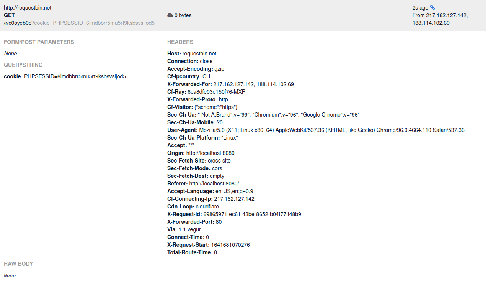


Il peut ensuite remplacer son propre cookie de session par le cookie de session de l'admin. Il aura réussi à prendre possession du compte de l'administrateur.

- Attaque CSRF
  - Voir le point **Modification des données** 
- Vol de token
  - Comme la communication n'utilise pas HTTPS, il suffit de récupérer des credentials ou un cookie de session avec wireshark par exemple comme dans le point **Vol de mot de passe**.

Contrôles: 

- Validation des entrées
- Token anti-CSRF
- Utiliser HTTPS pour sécuriser les connexions

#### Scénario 8: Élévation de privilège

Stride: tampering, repudiation, elevation of privileges

Impact: faible (données personnelles, réputation)

Source de la menace: employé mécontent, hacker

Motivation: avoir accès aux fonctionnalités des administrateurs, défi

Cible: formulaire

Scénario d'attaque: 

- Attaque CSRF

  - Voir le point **Modification des données** 

Contrôles:

- Token anti-CSRF

#### Scénario 9: Intrusion dans la base de données

Stride: spoofing, information disclosure

Impact: moyen (perte de confidentialité et d'intégrité)

Source de la menace: employé mécontent, hacker, cybercriminel, concurrent 

Motivation: accéder aux données

Cible: base de données

Scénario d'attaque: 

- Mot de passe faible
  - Un attaquant sachant que la base de données est accessible via l'url `http://localhost:8080/phpliteadmin.php` pourrait aller sur la page et se retrouver face à la page de connexion. Le mot de passe étant "admin", il serait facile de le trouver. L'attaquant aurait ensuite accès à toute la base de données.

Contrôles:

- Mettre un nouveau mot de passe dans le fichier *phpliteadmin.php*. 


## Les contre-mesures

### Politique de mots de passe

Concerne: scénario 5

Une politique de mot de passe a été instaurée. Le mot de passe doit faire au minimum 8 caractères (et au maximum 20 caractères). Il doit également contenir 1 minuscule, 1 majuscule, 1 chiffre et 1 caractère spécial.

Pour ce faire, le code suivant a été utilisé:

```php
if (preg_match("#.*^(?=.{8,20})(?=.*[a-z])(?=.*[A-Z])(?=.*[0-9])(?=.*\W).*$#", $password)){
	[......]
} else {
            $_SESSION['error'] = "Password must be at least 8 characters in length and must contain at least one number, one upper case letter, one lower case letter and one special character.";
        }
```

Il a été ajouté dans les fichiers `modify_user.php`, `new_password.php` et `new_user.php` car ce sont les 3 endroits où un mot de passe peut être défini.


### Ralentir le bruteforce pour les logins

Concerne: scénario 5

En plus de la politique de mot de passe, nous avons décider d'ajouter un CAPTCHA afin d'empêcher (ralentir très fortement) le test par brute-force des mots de passe. Ainsi, il est impraticable d'essayer de brute-forcer les mots de passe de cette manière.

Pour ce faire, la solution clé en main de [reCAPTCHA](https://www.google.com/recaptcha/about/) de Google a été utilisée.


### Identifiants de sessions 

strict mode


### HTTPONLY


### Hachage de mots de passe

Afin de garantir la sécurité même en cas de hack, nous avons décider de hacher les mots de passe.

Pour ce faire, nous avons utilisé la fonction `password_hash(string $password, string|int|null $algo)` avec l'algorithme bcrypt.


### Mot de passe de la base de donnée fort

Concerne: scénario 9

Afin de renforcer l'interface administrateur nous avons modifié le mot de passe de la base de donnée dans le fichier `phpliteadmin.php` afin qu'il respecte une politique de sécurité plus élevée.


### Protection CSRF

Concerne: scénarios 4, 7, 8

Un token anti-csrf est généré lors de la création de la session. Ce token est envoyé avec chaque formulaire et est validé par le serveur.

Pour créer le token dans le fichier `action_login.php`:

```php
$_SESSION['token'] = bin2hex(openssl_random_pseudo_bytes(32));
```

Pour renvoyer un token dans un formulaire:

```php
<input type="hidden" name="token" value="<?php echo $_SESSION['token'] ?>">
```

Le code ci-dessus a été ajouté dans les fichiers `add_user.php`, `edit_user.php`, `inbox.php`, `new_message.php`, `password.php` et `reply_message.php`. 

Pour que le serveur valide le token:

```php
$token = filter_input(INPUT_POST, 'token', FILTER_SANITIZE_STRING);
    if (!$token || $token !== $_SESSION['token']) {
        // return 405 http status code
        header($_SERVER['SERVER_PROTOCOL'] . ' 405 Method Not Allowed');
        exit;
    }
```

Le code ci-dessus a été ajouté dans les fichiers `action_delete_message.php`, `action_send_message.php`, `delete_user.php`, `modify_user.php`, `new_password.php` et `new_user.php`.


### Protection XSS

Concerne: scénarios 1 et 7

Les éléments contrôlables par les utilisateurs (message, sujet, nom d'utilisateurs) qui seront affichés sont convertis par la fonction `htmlspecialchars` pour empêcher l’exécution de script JS en enlevant les caractères spéciaux.

Par exemple:

```php
            $secureData = htmlspecialchars($data, ENT_QUOTES, 'UTF-8');
```

Ce code a été ajouté dans les fichiers `send_messages.php` et `new_user.php`.


### Protection injection SQL

Concerne: scénarios 2, 3, 4, 7

Les query SQL utilisent désormais des prepareds statements à la place de simple concaténation.

Par exemple:

```php
        $sql = $file_db->prepare("SELECT * FROM messages WHERE id = :id AND recipient = :email");
        $sql->bindParam('email', $email);
        $sql->bindParam('id', $id);
        $sql->execute();
```

Ce code a été ajouté dans les fichiers `inbox.php`, `read_message.php`, `delete_user.php`, `modify_user.php`, `new_password.php` et `new_user.php`. 


### Version des logiciels

:warning: Pas réalisé

Il faudrait mettre à jour les différents logiciels (nginx, jquery, php). NGINX dans notre projet possède la version 1.4.6 et PHP possède la version 5.5.9. Des failles existent sur ces versions.

### HTTPS

:warning: Pas réalisé

Concerne: scénario 6 et 7

Il faudrait que l'application web soit uniquement utilisable en HTTPS. Pour ce faire, il faudrait générer un certificat HTTPS.


## Conclusion

Pour conclure, grâce à l'analyse de menaces, notre application est maintenant plus sécurisée. Beaucoup de vulnérabilités ont été identifiées et des contre-mesures ont été ajoutées pour qu'elles ne se produisent plus. Il reste encore à mettre le site en HTTPS pour une sécurité optimale ainsi que mettre à jour les différentes versions des logiciels utilisés.

Grâce à ce projet, nous nous rendons compte que les analyses de menaces devraient être réalisées à chaque création d'une nouvelle application. Elles permettent vraiment de se rendre compte des vulnérabilités.

Ce projet nous a permis d'acquérir des réflexes en matière de sécurité ainsi que de tester des scénarios d'attaques tout en corrigeant les failles qui ont pu être exploitée par la suite. La principale difficulté rencontrée a été l'établissement du DFD. En effet, il était difficile de comprendre ce qui était réellement attendu le concernant.
