# Rapport étude de menaces

Auteurs: Besseau Léonard et Cerottini Alexandra

Date: 09.01.2022


## Introduction

Ce projet est une application Web permettant d'envoyer des messages électroniques entre des utilisateurs au sein d'une entreprise. Il permet en plus à des administrateurs de gérer les différents utilisateurs (ajout, modification ou suppression d'un utilisateur).

Les technologies utilisées sont Docker, PHP et SQLite.

L'objectif du projet est d'identifier les failles de sécurité au niveau applicatif, d'analyser les menaces et de sécuriser l'application développée par un des membres du groupe du projet 1. Le cahier des charges du projet 1 doit être respecté.

Nous allons seulement nous intéresser aux vulnérabilités introduites par le code PHP. La sécurisation du serveur web et de la machine sera ignorée. Des recommandations pourront être émises mais ne seront pas corrigées.


## Le système

### Objectifs

Le système a pour objectif de permettre à des employés au sein d'une entreprise de s'envoyer des messages électroniques. Le contenu de l'application est donc dynamique et généré par les utilisateurs. L'application est importante pour la communication interne de l'entreprise.


### Hypothèses de sécurité

- Une personne externe ne peut pas avoir un compte. 
- Seulement les employés actif de l'entreprise peuvent utiliser l'application web
- Les administrateurs de la base de données et de l'application sont de confiance.
- Il est impossible d'usurper l'identité du serveur.


### Exigences de sécurité

- Il faut être authentifié pour utiliser l'application web

- Le compte de l'utilisateur doit être actif pour pouvoir se connecter 

- Seuls les administrateurs peuvent ajouter, supprimer ou modifier un utilisateur

- Seuls les administrateurs peuvent voir les informations personnelles (mail, validité, rôle) des autres utilisateurs mais ils ne peuvent pas voir leur mot de passe

- Personne ne peut lire et supprimer les messages électroniques qui sont destinés à d'autres personnes.

- Personne ne peut supprimer ou modifier un message après l'avoir envoyé.

- Personne ne peut envoyer un message électronique au nom d'une autre personne.

  

### Constitution

#### Élements du système

- Base de données des utilisateurs

- Base de données des messages électroniques

- Application Web (Server applicatif php + server web NGINX)

  

#### Rôles des utilisateurs

- Collaborateur

Les collaborateurs peuvent lire les messages électroniques qu'ils ont reçu, écrire un nouveau message à l'attention d'un autre utilisateur ou d'eux-même, répondre à un message, supprimer un message et changer leur propre mot de passe.

- Administrateur

Les administrateurs ont accès aux mêmes fonctionnalités que les collaborateurs mais ils peuvent en plus ajouter, modifier ou supprimer un utilisateur.


### DFD


### Les biens

- Application Web

  - Disponibilité

  L'application se doit d'être disponible pour être utilisable. Son interruption pourrait perturber le fonctionnement de l'entreprise.

  - Authenticité + Confidentialité

  Seuls les membres de l’entreprise ont accès à l'application. Une personne externe à l'entreprise pourrait obtenir des informations confidentielles autrement.

- La base de données
  - Table users (liste des utilisateurs)

    - Confidentialité

    Les données personnelles ne doivent pas être accessibles aux autres utilisateurs. (Sphère privée)

    - Intégrité

    Une modification des données pourrait nuire à un utilisateur.

  - Table messages (liste des messages)

    - Confidentialité

    Les messages entre 2 utilisateurs sont censés être confidentiels pour tous les autres utilisateurs

    - Intégrité

    Un message ne doit pas être modifié après envoi ou supprimé par l'auteur (non-répudiation)

    - Authenticité

    L'auteur d'un message doit être le véritable auteur (réputation)

L'application web doit seulement être accessible aux collaborateurs et aux administrateurs (sauf la page de login). Les actions des administrateurs sur les utilisateurs sont confidentielles et seulement les administrateurs peuvent les réaliser.

La base de données contient des données sensibles sur les utilisateurs comme leur mot de passe ainsi que les messages qu'ils ont échangé. Il faut de la confidentialité.

Si un incident se produit, celui-ci nuirait la réputation de l'application Web et entraînerait un problème de communication au sein de l'entreprise. De plus, il y aurait une perte de confiance de la part des employés.


### Périmètre de sécurisation

- Personne sauf les administrateurs ne doit pouvoir accéder à la page de gestion des utilisateurs
- Personne ne doit avoir accès aux messages des autres utilisateurs
- Personne ne doit pouvoir envoyer un message en se faisant passer pour quelqu'un d'autre
- Personne ne doit pouvoir modifier ou supprimer un message après l'avoir envoyé
- Personne ne doit pouvoir récupérer le mail et le mot de passe d'un utilisateur


## Identifier les sources de menaces

- Employés mécontents
  - Motivation: vengeance, curiosité, espionnage industriel
  - Cible: lire des messages d'autres utilisateurs ou élévation de privilège
  - Potentialité: haute
- Cybercriminels
  - Motivation: financières
  - Cible: vol de credentials des utilisateurs, modification d'informations, phishing
  - Potentialité: moyenne
- Concurrents
  - Motivation: espionnage industriel
  - Cible: lire les messages des utilisateurs, déni de service
  - Potentialité: moyenne
- Hackers, script-kiddies
  - Motivation: s'amuser, gloire
  - Cible: n'importe quel élément /actif
  - Potentialité: faible


## Les scénarios d'attaques

#### Scénario 1: Indisponibilité du service

Stride: denial of service

Impact: élevé (financier)

Source de la menace: hacker, concurrent, employé mécontent

Motivation: défi, rançon (crime organisés), gêner l'activité 

Cible: serveur web

Scénario d'attaque: 

- XSS
  - Une injection XSS peut être faite dans le sujet ou le corps du message

- Bug avec fuite de mémoire

Contrôles: Validation des entrées

#### Scénario 2: Récupération des données internes

Stride: information disclosure, elevation of privilege, tampering

Impact: élevé (financier, réputation, données personnelles)

Source de la menace: concurrent, hacker, cybercriminel, employé mécontent

Motivation: récupérer des informations

Cible: base de données

Scénario d'attaque: 

- Injection SQL

  - Avec une injection SQL, on peut afficher le premier mail de la base de données. Dans le code HTML de l'inbox, l'attaquant connecté sur l'application web peut modifier la value du mail de son choix en y ajoutant une requête SQL par exemple:

    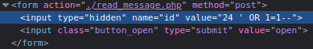

    Lorsqu'il cliquera sur le bouton *open*, le premier mail de la base de donnée s'affichera alors que celui-ci ne lui était pas destiné.

- CSRF

  - L'attaquant peut construire une attaque CSRF modifiant automatiquement le mot de passe de l'admin par un mot de passe voulu et par exemple envoyer un faux site web à l'admin par mail. Lorsque l'admin se cliquera sur ce site web malicieux, il sera redirigé sur le site web vulnérable et son mot de passe aura été modifié sans qu'il s'en aperçoive. L'attaquant pourra ensuite se connecter sur le compte de l'admin et accéder aux données de celui-ci.

    ```php+HTML
    <form action="../logic/new_password.php" method="post">
            <div class="form_container">
                <label for="email"><b>Email</b></label>
                <input type="text" name="email" readonly class="form-control" value="<?= $_SESSION['email'] ?>" " >
    
                <label for="psw"><b>New password</b></label>
                <input type="password" placeholder="Enter new password" name="pswd" required>
                <button type="submit">Change</button>
            </div>
        </form>
    ```

    Dans ce formulaire, il faudrait modifier les différentes informations en commençant par modifier l'url de l'action et en y mettant `http://localhost:8080/view/password.php`. Il faut aussi y insérer l’émail de l'admin à qui l'on veut modifier le mot de passe. Il faut également ajouter un champ `value` et y mettre le mot de passe que l'on souhaite. À la fin, il faut y insérer une balise script contenant:

    ```php+HTML
    <script>document.forms[0].submit();<\script>
    ```

    Lorsque l'admin ira sur cette page web, une requête HTTP sera automatiquement envoyée à l'application web vulnérable.

- Authentification+ Autorisation bypass

  - Il suffit de récupérer des credentials ou un cookie de session avec wireshark par exemple ou une injection

- Modification du HTML

  - Un employé connecté sur l'application web peut consulter n'importe quel message de la base de donnée en modifiant la valeur du message et en cliquant pour l'ouvrir

    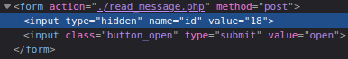


Contrôles: 

- Validation des entrées
- Contrôle des accès
- Token anti-CSRF
- Vérifier que l'action est effectuée sur un message appartenant à l'utilisateur

#### Scénario 3: Suppression des données

Stride: tampering, repudiation

Impact: élevé (financier, données personnelles)

Source de la menace: employé mécontent, concurrent

Motivation: supprimer des informations

Cible: base de données

Scénario d'attaque: 

- Injection SQL

  - Avec une injection SQL, on peut supprimer tous les mails de la base de données. Pour ce faire, dans le code HTML de l'inbox, l'attaquant connecté sur l'application web peut modifier la value du mail de son choix en y ajoutant une requête SQL par exemple:

    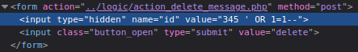

    345 étant un id non valable pour un mail. Lorsqu'il cliquera sur le bouton *delete*, tous les mails seront supprimés.

- Autorisation bypass

  - Il suffit de récupérer des credentials ou un cookie de session avec wireshark par exemple ou une injection

- Modification du HTML

  - Un employé connecté sur l'application web peut supprimer n'importe quel message de la base de donnée en modifiant la valeur du message et en cliquant pour le supprimer

    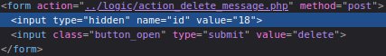

Contrôles: 

- Validation des entrées
- Contrôle des accès
- Token anti-CSRF
- Vérifier que l'action est effectuée sur un message appartenant à l'utilisateur

#### Scénario 4: Modification des données

Stride: repudiation, tampering, elevation of privileges

Impact: élevé (financier, données personnelles)

Source de la menace: employé mécontent

Motivation: supprimer des informations

Cible: base de données

Scénario d'attaque: 

- Injection SQL

  - Avec une injection SQL, il est possible de modifier les mots de passes de toute la base de données. Il suffit à l'attaquant connecté sur l'application web d'aller dans *Change password* puis de modifier l'HTML avec faux utilisateur et l'injection puis de changer le mot de passe. Par exemple:

    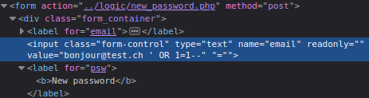

    Nous pouvons voir sur *phpliteadmin* que tous les utilisateurs ont les mêmes mots de passes

    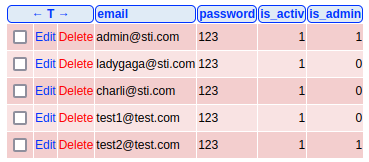

    L'attaquant peut donc accéder à tous les comptes.

- CSRF

  - Un attaquant peut forcer l'administrateur à changer son mot de passe. Voir le point **Récupération de données internes**  

- Autorisation bypass

  - Il suffit de récupérer des credentials ou un cookie de session avec wireshark par exemple ou une injection

- Modification du HTML

  - Un attaquant connecté sur l'application web peut modifier dans l'HTML le mot de passe de n'importe quel utilisateur. Pour ce faire, il lui suffit de modifier l'email et de choisir le mot de passe qu'il veut. Par exemple:

    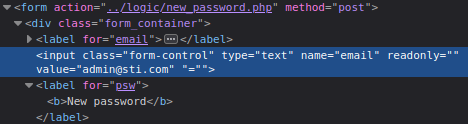


Contrôles: 

- Validation des entrées
- Contrôle des accès

#### Scénario 5: Deviner un mot de passe

Stride: spoofing

Impact: moyen (données personnelles, réputation)

Source de la menace: employé mécontent, hacker, cybercriminel, concurrent

Motivation: usurpation d'identité, lire messages de quelqu'un d'autre, avoir accès aux fonctionnalités des administrateurs, défi, accès à l'application

Cible: credentials

Scénario d'attaque: 

- Tests de mots de passe simple (ex: 123) car aucune vérification
  - L'attaquant peut tester une liste de mot de passe récurrents à l'aide d'un outil car lors de la création d'un compte ou lors du changement du mot de passe, il n'est pas demandé que celui-ci comporte un nombre minimum de caractères, de chiffres ou de caractères spéciaux.

- Tests de différents mots de passe autant de fois que l'on veut
  - L'attaquant peut tester n'importe quel mot de passe à volonté à l'aide d'un outil.


Contrôles: 

- Mettre en place un mot de passe fort (au moins 8 caractères avec 1 chiffre et 1 caractère spécial)
- Limiter le nombre de tentatives de login

#### Scénario 6: Vol de mot de passe

Stride: spoofing, information disclosure 

Impact: élevé (données personnelles, réputation)

Source de la menace: employé mécontent 

Motivation: usurpation d'identité, lire messages de quelqu'un d'autre, avoir accès aux fonctionnalités des administrateurs

Cible: credentials

Scénario d'attaque: 

- Un employé peut utiliser Wireshark sur le réseau interne de l'entreprise

  - Les informations transitent en clair sur le réseau donc lorsqu'un utilisateur se connecte à son compte, une autre personne se trouvant sur le même réseau peut sniffer le trafic et récupérer les credentials de cet utilisateur.

    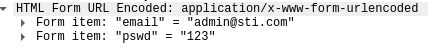


Contrôles: 

- Utiliser HTTPS pour sécuriser les connexions

#### Scénario 7: Vol de session/Compte

Stride: spoofing, tampering, repudiation, information disclosure, elevation of privileges

Impact: élevé (données personnelles, réputation)

Source de la menace: employé mécontent, hacker, cybercriminel, concurrent

Motivation: usurpation d'identité, lire messages de quelqu'un d'autre, avoir accès aux fonctionnalités des administrateurs, défi, accès à l'application

Cible: cookie de session

Scénario d'attaque: 

- Injection SQL

On peut injecter `' or 1=1 --+` à la place du mot de passe lorsque l'on essaye de se login et l'on peut se connecter sans avoir le mot de passe

- Voler un cookie de session PHP par défaut (PHPSESSID) avec une attaque XSS

  - Grâce à [Requestbin](https://requestbin.net/) (un site nous permettant de récupérer des requêtes), un attaquant peut voler le cookie de session de l'admin. Pour ce faire, il lui suffit d'envoyer un mail contenant une attaque XSS à l'admin (l'attaque peut être réalisé dans le subject ou dans le message).

    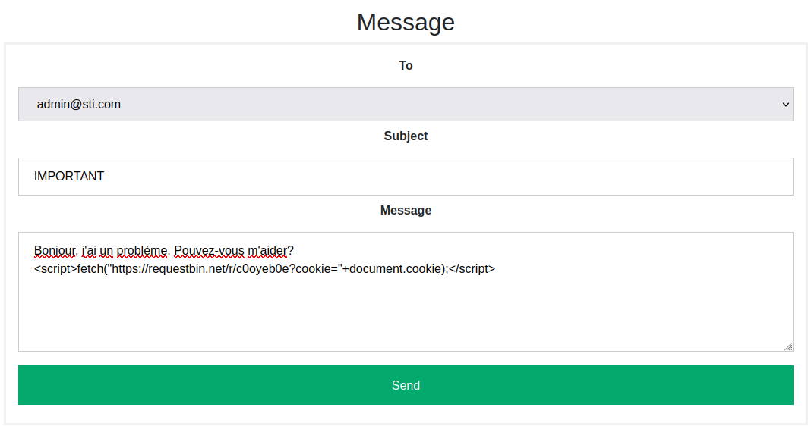

    Lorsque l'admin ouvrira le message il ne verra rien d'anormal mais l'attaque XSS aura été réalisée.

    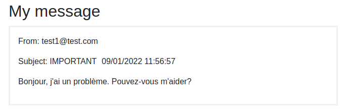

    Sur RequestBin, l'attaquant peut récupérer le cookie de session de l'admin.

    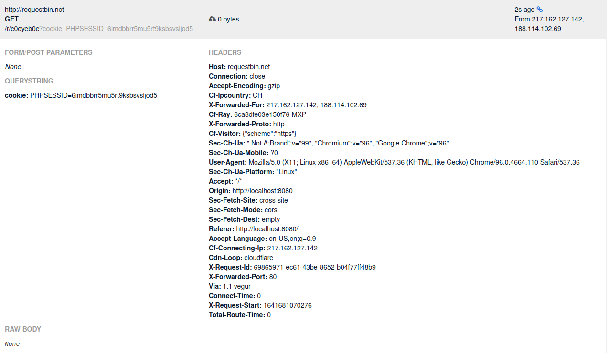


Il peut ensuite remplacer son propre cookie de session par le cookie de session de l'admin. Il aura réussi à prendre possession du compte de l'administrateur.

- Attaque CSRF
  - Voir le point **Récupération de données internes** 

Contrôles: 

- Validation des entrées
- Token anti-CSRF

#### Scénario 8: Élévation de privilège

Stride: tampering, repudiation, elevation of privileges

Impact: faible (données personnelles, réputation)

Source de la menace: employé mécontent

Motivation: avoir accès aux fonctionnalités des administrateurs

Cible: formulaire

Scénario d'attaque: 

- Attaque CSRF

  - L'attaquant pourrait, grâce à une attaque CSRF, forcer l'admin à modifier le rôle de l'attaquant pour le faire passer de collaborateur à administrateur. L'attaquant peut construire une page web contant l'HTML avec le formulaire pour modifier un membre et l'envoyer par email à l'administrateur

    ```php+HTML
    <form action="../logic/modify_user.php" method="post">
            <div class="form_container">
                <label for="email"><b>Email</b></label>
                <input type="text" name="email" readonly class="form-control" value="<?= $value ?>" " >
    
                <label for="psw"><b>Password</b></label>
                <input type="password" placeholder="Enter Password" name="pswd">
    
                <label for="active"><b>Active?</b></label>
                <select name="active">
                    <option value="1">Yes</option>
                    <option value="0" selected>No</option>
                </select>
    
                <label for="admin"><b>Admin?</b></label>
                <select name="admin">
                    <option value="1">Yes</option>
                    <option value="0" selected>No</option>
                </select>
    
                <button type="submit">Ok</button>
            </div>
        </form>
    ```

    Dans ce formulaire, il faudrait modifier les différentes informations en commençant par modifier l'url de l'action et en y mettant `http://localhost:8080/view/edit_user.php?email=test1@test.com`. Il faut aussi y insérer l’émail de l'employé à qui l'on veut élever les privilèges (ici test1@test.com). Il faut également modifier les options sélectionnées pour les paramètres "active" et "admin". À la fin, il faut y insérer une balise script contenant:

    ```php+HTML
    <script>document.forms[0].submit();<\script>
    ```

    Lorsque l'admin ira sur cette page web, une requête HTTP sera automatiquement envoyée à l'application web vulnérable.

Contrôles:

- Token anti-CSRF

#### Scénario 9: Intrusion dans la base de données

Stride: spoofing

Impact: moyen (perte de confidentialité et d'intégrité)

Source de la menace: employé mécontent, hacker, cybercriminel, concurrent 

Motivation: avoir accès à tout

Cible: base de données

Scénario d'attaque: 

- Mot de passe faible
  - Un attaquant sachant que la base de données est accessible via l'url `http://localhost:8080/phpliteadmin.php` pourrait aller sur la page et se retrouver face à la page de connexion. Le mot de passe étant "admin", il serait facile de le trouver. L'attaquant aurait ensuite accès à toute la base de données.

Contrôles:

- Mettre un nouveau mot de passe dans le fichier *phpliteadmin.php*. 


## Les contre-mesures

- Valider les inputs lors des requêtes
- Utiliser des requêtes SQL préparées
- Contrôle d'accès pour les messages et les données utilisateurs
- Contrôle d'accès pour les fonctionnalités de l'administrateur


## Conclusion

Pour conclure, grâce à l'analyse de menaces, notre application est maintenant plus sécurisée. Beaucoup de vulnérabilités ont été identifiées et des contre-mesures ont été ajoutées pour qu'elles ne se produisent plus. Il reste encore à mettre le site en HTTPS pour une sécurité optimale. 

Les analyses de menaces devraient être réalisées à chaque création d'une nouvelle application. Elles permettent vraiment de se rendre compte des vulnérabilités.

Ce travail nous a permis d'acquérir des réflexes en matière de sécurité ainsi que de tester des scénarios d'attaques.


Notes de Léonard:


password trop faible

On est admin et on peut lire les messages d'autre utilisateurs car les ID sont seuqentiel et qu'il n'y a pas de controle d'accès. (on va garder les id séquentiel mais on doit verif que c'est la bonne personne qui accède. On va faire un fetch et vérifier qui y accède et on retournera un forbidden)

XSS

perte de confidentialité


Utilisateur peut faire une XSS avec un nouveau message, on peut lire n'importe quel message même si il ne nous est pas adressé, 

à tester: 

- Est-ce qu'on peut supprimer les tables? 
- Est-ce qu'on est capable de changer nos droits?
- tester si y'a des vulnérabilités dans la version du PHP
- Utiliser du HTTPS pour sécuriser les connexions.


On peut faire une injection XSS sur le body mais également dans le subject. L'avantage de le faire dans le subject, c'est que l'utilisateur a juste besoin de se connecter et l'attaque aura lieu immédiatement alors que dans le body l'utilisateur doit ouvrir le message.

On peut supprimer tous les messages d'autres personnes. On peut injecter pour supprimer tous les messages
